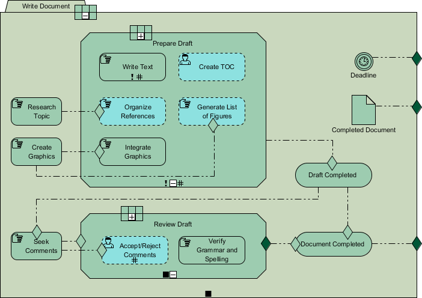

#CMMN

##What is Case Management Model and Notation (CMMN)
CMMN是一种图形符号，用于捕获基于处理需要各种活动的案例的工作方法，这些活动可能以不可预测的顺序执行以响应不断变化的情况
`CMMN is a graphical notation used for capturing work methods that are based on the handling of cases requiring various activities that may be performed in an unpredictable order 
in response to evolving situations`

Here is some reasons why we need CMMN in additional to BPMN:

- 传统上，商业信息系统的研究和实践侧重于结构良好的业务流程。但是，许多业务流程很难建模.
`Traditionally, the research and practice of business information systems focuses on well-structured business processes. However, many business processes are difficult to model.`

- 对于事故管理，咨询或销售等知识密集型任务尤其如此。实际上，许多活动是以临时方式开始和进行的，而不是事先计划好的。
`That is especially true for knowledge-intensive tasks such as incident management, consulting or sales. In fact, many activities are started and conducted in an ad-hoc way rather 
than being planned in advance.`
- 对于知识密集型或基于项目的活动尤其如此，这些活动通常代表组织的核心能力.
`This is especially the case for knowledge-intensive or project-based activities, which often represent the core competencies of an organization.`

##Ad-Hoc Process(特殊型流程)
Ad-Hoc Process 是一组业务活动和相应的工件（例如，信息，决策和产品），它们只能在高级别的聚合中进行标准化。实际的活动种类及其排序因个案而异。
`Ad-hoc processes are sets of business activities and corresponding artifacts (e.g. information, decisions and products) that can only be standardized at a high level of aggregation.
The actual kinds of activities and their ordering are different from case to case.`

Here is the characteristics of the Ad-hoc Process:

- 虽然可以预测某些活动，但是一开始就无法完全指定大部分过程，因为它需要的信息只能以某种方式进入项目。
`While certain activities can be predicted, much of the process cannot be fully specified at the start, since it requires information that only becomes available some way into the project.`
- 如果我们假设在ad-hoc process的上下文中永远不会确定下一步，则它们的执行不能由传统的基于流程的信息系统控制，在大多数情况下，知识工作者可以控制流程。
`If we assume that in the context of ad-hoc processes the next step is never determined, their execution cannot be controlled by classical process-based information systems, in most cases, knowledge workers are in control of the process.`
- 似乎不可能在设计时考虑临时过程的所有可能性，这样的过程模型将变得复杂且难以管理
`It seems impossible to think of all possibilities for an ad-hoc process by design time, such a process model would become complex and hard to manage`

##BPMN vs CMMN
Here listed the differences between BPMN and CMMN:

|Most of BPMN Notations	|CMMN Notation |
| -------- | -------- |
| 命令式(Imperative) |	声明式(Declarative) |
| 以流程为中心(Process centric) |	以数据为中心(Data centric) |
| 弧描述序列(Arcs describe the sequence) |	无预定序列(No predefined sequence) |
| 引导工作(Guided work (head down workers)) |	工作者判断(Enables workers (knowledge workers)) |
| 所有都是建模的(Everything is modeled) |	并非一切都是建模的(Not everything is modeled)|

声明性表示法不会尝试模拟问题的流程;他们建立了预期的结果，即指明他们想要发生什么，但不指明它应该如何发生。 
SQL是声明性编程的一个例子，因为它不会试图控制程序的流程;它只是陈述了它想要出现的内容，而不是它是如何完成的

另一方面，命令式表示法试图模拟问题的流程;例如，命令式编程语言，如Java或C ++，它们建立的命令将告诉编译器他们希望代码如何运行，但不能明确告诉他们想要发生什么。
```text
Declarative Notation does not attempt to model the flow of a problem; they establish desired results i.e. specifying what they want to happen but not how it should happen.
SQL is an example of declarative programming because it does not attempt to control the flow of a program; it simply states what it would like to appear but not how it is done.

Imperative Notation, on the other hand, do attempt to model the flow of a problem; for example, imperative programming languages such as Java or C++, 
they establish commands that will tell the compiler how they wish the code to run but not explicitly what they want to happen.
```
##CMMN Example
下面研究一个写论文的CMMN的模型：




